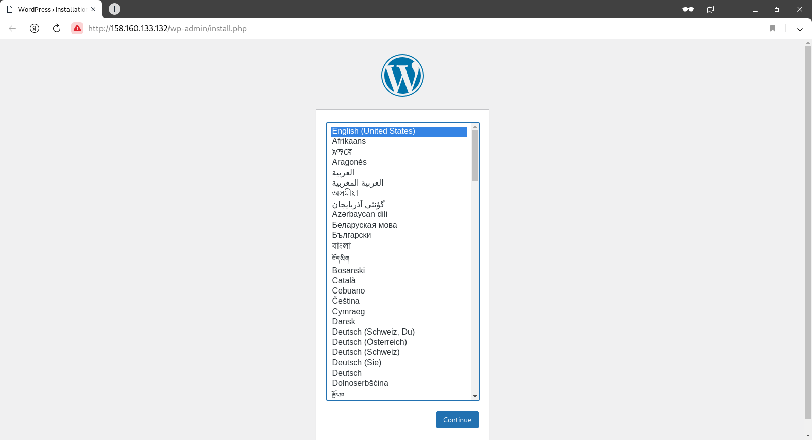

# lab-12
otus | kubernetes

### Домашнее задание
деплой в k8s

#### Цель:
инсталляция k8s на виртуальные машины и скрипты автоматического деплоя конфигурации кластера веб портала из предыдущих занятий в k8s
бэкап конфигурации кластера

#### Критерии оценки:
Статус "Принято" ставится при выполнении перечисленных требований.


### Выполнение домашнего задания

#### Создание стенда

Стенд будем разворачивать с помощью Terraform на YandexCloud, настройку серверов будем выполнять с помощью Kubernetes.

Необходимые файлы размещены в репозитории GitHub по ссылке:
```
https://github.com/SergSha/lab-12.git
```

Для начала получаем OAUTH токен:
```
https://cloud.yandex.ru/docs/iam/concepts/authorization/oauth-token
```

Настраиваем аутентификации в консоли:
```
export YC_TOKEN=$(yc iam create-token)
export TF_VAR_yc_token=$YC_TOKEN
```

Скачиваем проект с гитхаба:
```
git clone https://github.com/SergSha/lab-12.git && cd ./lab-12
```

В файле input.auto.tfvars нужно вставить свой 'cloud_id':
```
cloud_id  = "..."
```

Kubernetes кластер будем разворачивать с помощью Terraform, а все установки и настройки необходимых приложений будем реализовывать с помощью команд kubectl и helm.

Установка kubectl с помощью встроенного пакетного менеджера:
```
# This overwrites any existing configuration in /etc/yum.repos.d/kubernetes.repo
cat <<EOF | sudo tee /etc/yum.repos.d/kubernetes.repo
[kubernetes]
name=Kubernetes
baseurl=https://pkgs.k8s.io/core:/stable:/v1.29/rpm/
enabled=1
gpgcheck=1
gpgkey=https://pkgs.k8s.io/core:/stable:/v1.29/rpm/repodata/repomd.xml.key
EOF
sudo dnf install -y kubectl
```

Установка helm:
```
curl -LO https://get.helm.sh/helm-v3.13.3-linux-amd64.tar.gz
tar -xf ./helm-v3.13.3-linux-amd64.tar.gz
sudo mv ./linux-amd64/helm /usr/local/bin/
rm -rf ./helm-v3.13.3-linux-amd64.tar.gz ./linux-amd64/
```

Для того чтобы развернуть kubernetes кластер, нужно выполнить следующую команду:
```
terraform init && terraform apply -auto-approve
```

По завершению команды получим данные:

Информация о kubernetes кластере k8s-lab:
```
[user@rocky9 lab-12]$ kubectl cluster-info
Kubernetes control plane is running at https://51.250.17.133
CoreDNS is running at https://51.250.17.133/api/v1/namespaces/kube-system/services/kube-dns:dns/proxy
```

Информация о нодах kubernetes кластера:
```
[user@rocky9 lab-12]$ kubectl get nodes -o wide
NAME                        STATUS   ROLES    AGE   VERSION   INTERNAL-IP   EXTERNAL-IP   OS-IMAGE             KERNEL-VERSION      CONTAINER-RUNTIME
cl1mg330383d2ocabi8s-igyf   Ready    <none>   78m   v1.25.4   10.1.0.24     <none>        Ubuntu 20.04.6 LTS   5.4.0-165-generic   containerd://1.6.22
cl1mg330383d2ocabi8s-ocux   Ready    <none>   78m   v1.25.4   10.1.0.34     <none>        Ubuntu 20.04.6 LTS   5.4.0-165-generic   containerd://1.6.22
```

В качестве балансировщика будем использовать Contour Ingress (https://projectcontour.io/):
```
kubectl apply -f https://projectcontour.io/quickstart/contour.yaml
```

Установим mysql:
```
helm upgrade --install mysql ./Charts/mysql/ -f ./Charts/values.yaml
```

Установим wordpress:
```
helm upgrade --install wordpress ./Charts/wordpress/ -f ./Charts/values.yaml
```

С помощью следующей команды:
```
kubectl describe ingress wordpress-ingress
```

получим публичный IP для доступа к веб-странице WordPress:
```
[user@rocky9 lab-12]$ kubectl describe ingress wordpress-ingress
Name:             wordpress-ingress
Labels:           app=wordpress
                  app.kubernetes.io/managed-by=Helm
Namespace:        default
Address:          158.160.133.132      # <--- Public IP address
Ingress Class:    contour
Default backend:  <default>
Rules:
  Host        Path  Backends
  ----        ----  --------
  *           
              /   wordpress-svc:80 (10.112.128.10:80,10.112.129.7:80)
Annotations:  meta.helm.sh/release-name: wordpress
              meta.helm.sh/release-namespace: default
Events:       <none>
[user@rocky9 lab-12]$ 
```

Полученный IP адрес вводим в адресной строке браузера, получим стартовую веб-страницу Wordpress:



Можно сделать вывод, что развёрнутый kubernetes кластер работает должным образом.


#### Удаление стенда

Удалить развернутый стенд командой:
```
terraform destroy -auto-approve
```

